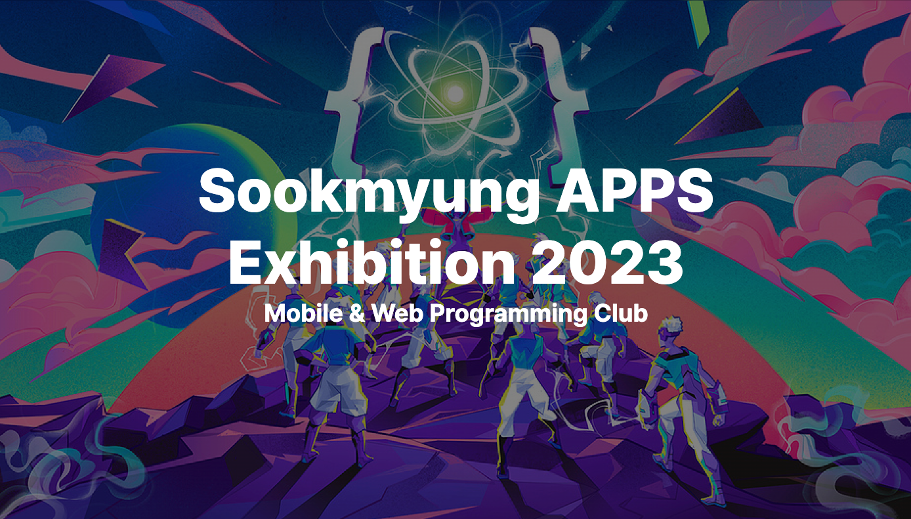
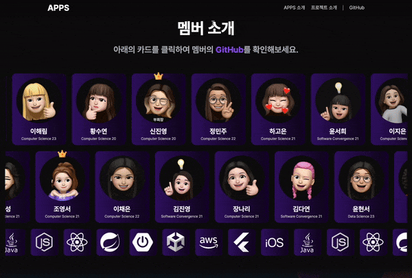

  <h1>Sookmyung APPS Exhibition 2023</h1>
  
<a href='https://github.com/APPS-sookmyung'>숙명여자대학교 소프트웨어학부 학회 APPS</a>   온라인 전시회

   

 

## 🗂️ 목차

1. [**웹 서비스 소개**](#1)
2. [**기술 스택**](#2)
3. [**데모 영상**](#3)
4. [**개발 팀 소개**](#4)
5. [**개발 기간**](#5)

 

## 💡 웹 서비스 소개

숙명여자대학교 소프트웨어학부 학회 APPS의 <U>2023 온라인 전시회 사이트</U> 입니다. 
3월부터 열심히 노력하여 마침내 16개의 작품을 선보이게 되었습니다. 아래 사이트에서 그 힘찬 결실을 만나보실 수 있습니다.

[**🔗 배포된 웹 사이트 바로가기 Click !**](https://2023-apps-exhibition-webpage.vercel.app/) 👈  
[**🔗 LinkedIn에서 온라인 전시회 글 확인 (23/12/30) Click !**](https://www.linkedin.com/feed/update/urn:li:activity:7146839338822098944) 👈  
[**🔗 LinkedIn에서 오프라인 전시회 글 확인 (24/3/9) Click !**](https://www.linkedin.com/feed/update/urn:li:activity:7146839338822098944) 👈

> 새 창 열기 방법 : CTRL+click (on Windows and Linux) | CMD+click (on MacOS)

 

## 🛠 기술 스택

### **Front-end**

|  |  |  |  |
| :----------------------------------------------------------------------------------------------------------------------------: | :--------------------------------------------------------------------------------------------------------------------------: | :-----------------------------------------------------------------------------------------------------------------------------: | :-------------------------------------------------------------------------------------------------------------------------------: |
|                                                             HTML5                                                              |                                                             CSS3                                                             |                                                        JavaScript (ES6)                                                         |                                                             React.js                                                              |

### **Back-end**

|  |
| :--------------------------------------------------------------------------------------------------------------------: |
|                                                         Vercel                                                         |

### **Version Control**

|  |  |
| :---------------------------------------------------------------------------------------------------------------: | :--------------------------------------------------------------------------------------------------------------------: |
|                                                        Git                                                        |                                                         GitHub                                                         |

 

## 🎥 데모 영상

|                                              APPS 소개                                               |
| :--------------------------------------------------------------------------------------------------: |
|  |

|                                             APPS 멤버 소개                                              |
| :-----------------------------------------------------------------------------------------------------: |
|  |

|                                                    프로젝트 소개                                                    |
| :-----------------------------------------------------------------------------------------------------------------: |
|  |

|                                                   프로젝트 상세 페이지                                                   |
| :----------------------------------------------------------------------------------------------------------------------: |
|  |

 

## 👪 개발 팀 소개

 

|                                               이미지                                                |                                        이름 (세부 전공)                                        |   역할    |                                          개발 내용                                          |
| :-------------------------------------------------------------------------------------------------: | :--------------------------------------------------------------------------------------------: | :-------: | :-----------------------------------------------------------------------------------------: |
|  |    <a href="https://github.com/mxinseo" target="_blank">경민서 (소프트웨어융합 22)</a>    | Front-end |           메인페이지 내 APPS 소개 섹션 구현   메인페이지 내 애니메이션 구현            |
|  |    <a href="https://github.com/misung-dev" target="_blank">류미성  (컴퓨터과학 21)</a>    | Front-end | 메인페이지 내 프로젝트 소개 섹션 구현   Header & Footer 구현   모바일 반응형 구현 |
|  | <a href="https://github.com/seohee0925" target="_blank"> 윤서희  (소프트웨어융합 21) </a> | Front-end |                                  프로젝트 상세 페이지 구현                                  |

 

## 📅 개발 기간

2023년 8월 14일 ~ 2023년 12월 28일 (4개월)
